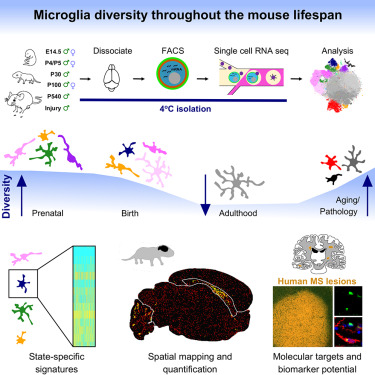

## Single-Cell RNA Sequencing of Microglia throughout the Mouse Lifespan and in the Injured Brain Reveals Complex Cell-State Changes

Complex cell-state changes revealed by single cell RNA sequencing of 76,149 microglia throughout the mouse lifespan and in the injured brain

[GEO Accession viewer (nih.gov)](https://www.ncbi.nlm.nih.gov/geo/query/acc.cgi?acc=GSE121654)

## Description and Specification:

This study contains single-cell RNA sequencing data from 76,149 FACS-purified mouse microglia across the lifespan and in an injury model. Key details include:

1. Timepoints/Conditions:

   - Embryonic: E14.5
   - Early postnatal: P4/P5
   - Juvenile: P30
   - Adult: P100
   - Aged: P540 (18 months)
   - Injury: Demyelination model in adult mice
2. Sample details:

   - 41 total animals used
   - 3-4 biological replicates per timepoint/condition
   - Male and female mice included
3. Brain regions:

   - Whole brain samples for most timepoints
   - Cortex and cerebellum samples at P100
   - White matter samples for injury model
4. Cell isolation:

   - FACS purification of microglia (CD45+, CD11b+, CX3CR1+)
5. Sequencing details:

   - Platform: Illumina NextSeq 500
   - 10x Genomics Chromium single-cell 3' RNA-seq
   - Read lengths:
     Samples 1-16: Read 1 = 98bp, Read 2 (barcode) = 14bp, Read 3 (UMI) = 10bp
     Samples 17-47: Read 1 (barcode+UMI) = 26bp, Read 2 = 98bp
6. Data processing:

   - Cell Ranger 1.2 pipeline for initial processing
   - Alignment to mm10 mouse genome
   - Clustering using ICA-based approach
7. Key analyses:

   - Identification of microglia subtypes across development and aging
   - Characterization of microglia states in demyelination injury model

This comprehensive dataset allows for analysis of microglia heterogeneity and state changes across the lifespan and in response to injury, providing insights into microglia biology in development, aging, and disease.

## Comments

This paper can be of interest especially the one frm aged mice 
